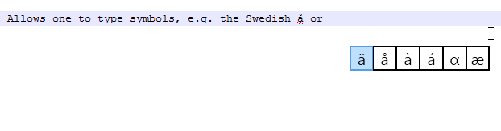

SymWin
======

Allows one to type special characters such as å or λ on Windows without the alt-key bullshit.

Inspired by Apple's iOS keyboard symbol selection, this shows a popup with symbols wherever you are typing.

It looks like this:

This is just an initial rough version which seems to be working.

Things I'd like to do:

- the code can be optimized
- add tasktray support
- add support for configuring symbols (via tasktray settings menu)
