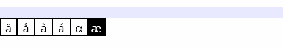

SymWin
======

Allows one to type special characters such as å or λ on Windows without the alt-key bullshit or frequent language switching which is just cumbersome.

Inspired by Apple's iOS keyboard symbol selection, this shows a popup with symbols wherever you are typing.

It looks like this:

To type a symbol hold down CAPSLOCK and then (say) the *a* key. This will show the above popup.

To type an uppercase symbol, simply add SHIFT to the above key sequence.

To cycle options keep pressing the letter key, or use the arrow keys on the keyboard. You can also use the mouse to select a symbol. To go backwards, hold the ALT key in addition to the other keys.

This is just an initial rough version which is working well in most applications.

Todo:
-----

- (perhaps) figure out the best way to run in the background with enough privileges to avoid UAC popups or run into UIPI windows issues - this isn't required to use this tool but it'd make it more generally available
- (perhaps) make "hot key" (currently CAPSLOCK) configurable
- how to deal with various cultures
- (perhaps) add support for configuring symbols (via tasktray settings menu)
- (perhaps) dynamically re-order symbols based on usage patterns (e.g. more frequently used symobls are faster to get to)

Finally
-------
I know CAPSLOCK may not appease everyone and my app currently disables it. I never use CAPSLOCK for anything meaningful and it is one of the few key combinations that I could think off that is not already used and is easy to type.
